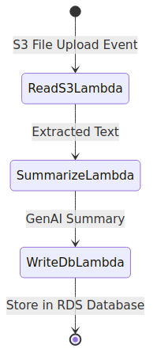

# Summafy SAM App Lambda

Summafy SAM App Lambda is a serverless backend for GenAI-powered document summarization, built using AWS Lambda, AWS SAM (Serverless Application Model), and Python. It is designed to extract text from documents (PDFs) uploaded to S3, process them, and generate summaries using generative AI models.

## Step Functions Workflow

This project uses an AWS Step Functions workflow to orchestrate the document summarization process:



**Workflow Steps:**
1. **ReadS3Lambda:** Triggered by an S3 upload event, extracts text from the uploaded PDF.
2. **SummarizeLambda:** Receives the extracted text and generates a summary using a GenAI model.
3. **WriteDbLambda:** Stores the summary and metadata in an Amazon RDS database. This step is required for the workflow.

## Features

- **Serverless Architecture:** Deployed using AWS Lambda and AWS SAM for scalability and low operational overhead.
- **S3 Integration:** Listens for new files in an S3 bucket and processes them automatically.
- **PDF Text Extraction:** Reads and extracts text from uploaded PDF files using PyPDF2.
- **GenAI Summarization:** Calls an external API (e.g., OpenAI) to generate document summaries.
- **Modular Design:** Separate Lambda functions for reading S3, summarizing content, and writing to the database.

## Directory Structure

```
summafy-sam-app-lambda/
├── events/           # Sample event payloads
├── readS3/           # Lambda for reading and extracting text from S3 PDFs
├── summarize/        # Lambda for calling GenAI API to summarize text
├── write_db/         # Lambda for writing results to an Amazon RDS database
├── tests/            # Test files
├── template.yaml     # AWS SAM template defining resources
└── ...
```

## How It Works

1. **File Upload:** User uploads a PDF to the configured S3 bucket.
2. **S3 Event Trigger:** S3 triggers the `readS3` Lambda, which extracts text from the PDF.
3. **Summarization:** The extracted text is passed to the `summarize` Lambda, which calls a GenAI API (e.g., OpenAI) to generate a summary.
4. **Write to DB:** The summary and metadata are saved to an Amazon RDS database via the `write_db` Lambda.

## Deployment

1. **Install AWS SAM CLI:**
   ```bash
   pip install aws-sam-cli
   ```
2. **Build the Application:**
   ```bash
   sam build
   ```
3. **Deploy to AWS:**
   ```bash
   sam deploy --guided
   ```

## Configuration
- Edit `template.yaml` to set up Lambda functions, environment variables, and permissions.
- Store sensitive values (like API keys) in AWS SSM Parameter Store or Secrets Manager.

## Requirements
- AWS account with permissions for Lambda, S3, and related services
- Python 3.12
- [PyPDF2](https://pypi.org/project/PyPDF2/)
- (For summarization) Access to a GenAI API (e.g., OpenAI)

## Related Topics
- Serverless Computing
- AWS Lambda
- AWS SAM
- Document Summarization
- Generative AI
- Python
- S3 Event Triggers
- OpenAI API

*Summafy SAM App Lambda powers the backend for GenAI document summarization in the Summafy ecosystem.*
