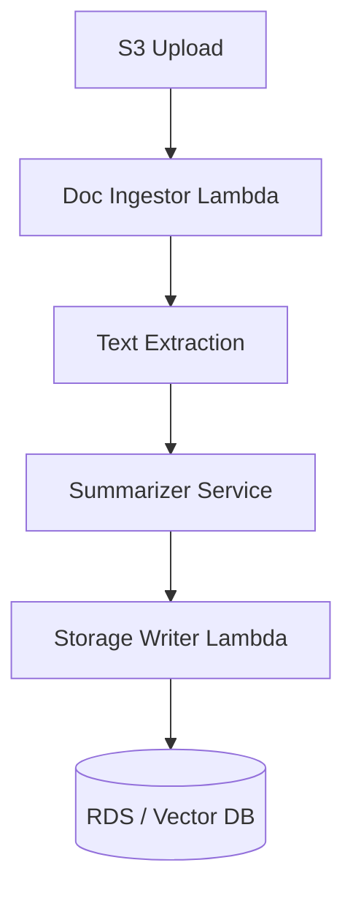

# Summafy AI Platform – GenAI-Powered Document Summarization

> A production-grade, serverless AI microservices backend to extract, summarize, and store content from documents using GenAI models. Built with AWS SAM, Lambda, Step Functions, and integrated DevOps pipelines for automation, observability, and scalability.

---

## ✨ Overview

**Summafy AI Platform** processes documents uploaded to S3, extracts content, summarizes it using generative AI models (OpenAI or local models), and stores the results in Amazon RDS or a vector database. It leverages AWS native services with a modular design to enable fast iteration, flexible deployment, and easy integration into downstream apps.

---

## 🧩 Architecture

### High-Level Workflow



---

## 📁 Monorepo Structure

This repository combines Lambda application code, infrastructure-as-code, CI/CD, and monitoring for unified deployment and observability.

```
summafy-ai-devops/
├── sam/                        # All AWS SAM (Lambda) code and configs
│   ├── template.yaml           # SAM template for Lambda functions and permissions
│   ├── samconfig.toml
│   ├── readS3/                 # Lambda: Read PDF from S3
│   ├── summarize/              # Lambda: Summarize text
│   ├── write_db/               # Lambda: Write to DB
│   ├── events/                 # Sample event payloads
│   ├── tests/                  # Lambda tests
│   └── ...                     # Other Lambda-related files
├── terraform/                  # All Terraform infrastructure code
│   ├── provider.tf
│   ├── roles.tf
│   ├── statemachine.tf         # Step Functions state machine definition
│   ├── monitoring.tf           # CloudWatch, alarms, logging, X-Ray, etc.
│   └── variables.tf            # (Optional) Terraform variables
├── ci/                         # CI/CD pipeline configs and scripts
│   ├── github-actions.yml      # Example: GitHub Actions workflow
│   └── ...                     # Other CI/CD configs (GitLab, Bitbucket, etc.)
├── scripts/                    # Helper scripts for deployment, testing, monitoring
│   ├── deploy.sh
│   ├── test.sh
│   └── monitor.sh
└── DEPLOYMENT_COORDINATION.md  # Guide for deployment & monitoring
```

---

## 🚀 Deployment & Monitoring Workflow

1. **Develop and test Lambda code in `sam/`.**
2. **Deploy Lambda functions with SAM.**
3. **Deploy/Update infrastructure and orchestration with Terraform in `terraform/`.**
4. **Automate both steps using CI/CD configs in `ci/`.**
5. **Monitor using resources defined in `terraform/monitoring.tf` and referenced in documentation/scripts.**

See [DEPLOYMENT_COORDINATION.md](../DEPLOYMENT_COORDINATION.md) for detailed instructions.

---
